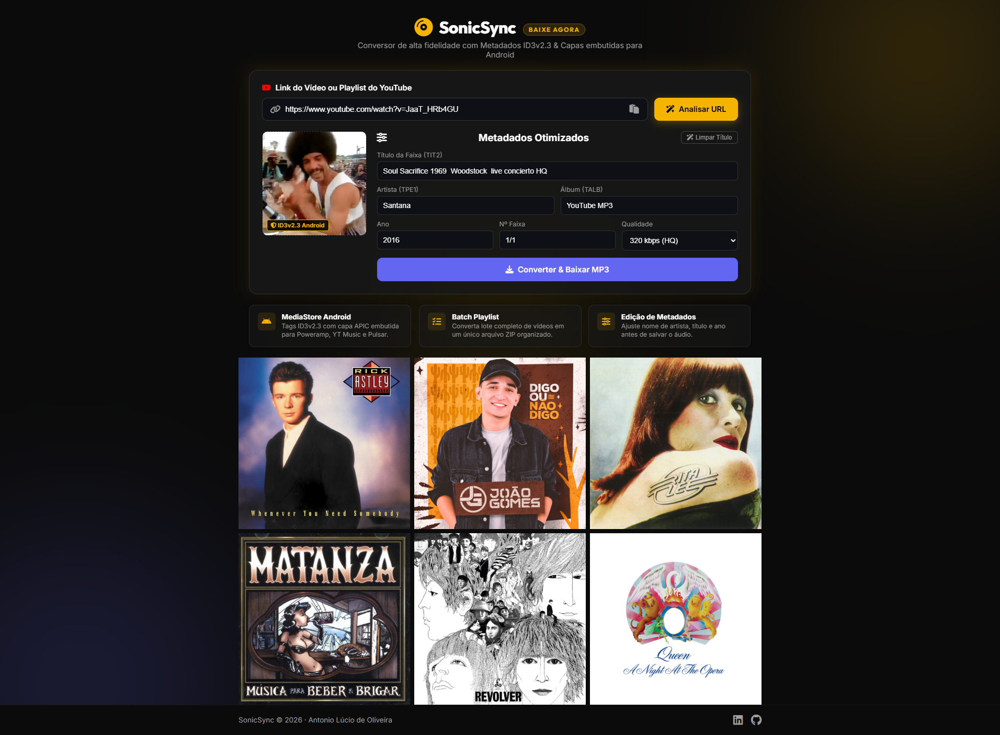

# 🎧 SonicSync — Conversor YouTube para MP3 de Alta Fidelidade

> Conversor moderno de vídeos e playlists do YouTube para MP3 com injeção automática de **metadados ID3v2.3** e **capas de álbuns de alta resolução embutidas**, otimizado para leitores de mídia no **Android** e **desktop**.

---

## 📸 Demonstração da Interface



---

## ⚡ Destaques & Funcionalidades

- 🎵 **Conversão de Alta Fidelidade:** Extração direta de áudio em até 320 kbps.
- 🏷️ **Metadados ID3v2.3 Completos:** Preenchimento automático de Título, Artista, Álbum, Ano, Gênero e Número da Faixa diretamente no arquivo `.mp3`.
- 🖼️ **Capas de Álbuns Embutidas:** Suporte a download de capas oficiais do iTunes/YouTube e injeção da imagem binária no próprio arquivo de áudio.
- 🎨 **Design Editorial de Alto Padrão (Spotify Inspired):**
  - Paleta escura elegante (*Deep Black* `#0B0B0B`, *Graphite* `#171717`, *Gold Yellow* `#F5B400`).
  - Mosaico de capas responsivo (`editorial-full-grid`) com efeito *hover*, pré-visualização e disparo imediato de conversão ao clicar.
  - Totalmente responsivo em dispositivos móveis (smartphones e tablets).
- 📜 **Suporte a Playlists & Download em ZIP:** Processamento de múltiplos vídeos com empacotamento automatizado em arquivos `.zip`.
- 🌐 **Zero Framework Overkill:** Frontend em **HTML5 Semântico**, **CSS3 Vanilla** e **JavaScript Puro**.

---

## 🛠️ Tecnologias Utilizadas

* **Frontend:** HTML5, CSS3 (Variáveis CSS, CSS Grid, Glassmorphism), Vanilla JavaScript, FontAwesome 6, Google Fonts (*Outfit, Inter, Bebas Neue*).
* **Backend:** Node.js, Express.js.
* **Processamento de Áudio e Mídia:** `node-id3` (Tags ID3v2.3), `axios` (iTunes Search API & Downloads), `archiver` (ZIP Stream).

---

## 🚀 Como Executar o Projeto Localmente

### Pré-requisitos
- [Node.js](https://nodejs.org/) (versão 18 ou superior instalada)
- `yt-dlp` e `ffmpeg` instalados e acessíveis no PATH do sistema.

### Passo a Passo

1. **Clonar o repositório:**
   ```bash
   git clone https://github.com/Quinito75/sonicsync.git
   cd sonicsync
   ```

2. **Instalar as dependências:**
   ```bash
   npm install
   ```

3. **Iniciar o servidor de desenvolvimento:**
   ```bash
   npm start
   ```
   *Ou utilizando live-reload:*
   ```bash
   npm run dev
   ```

4. **Acessar no navegador:**
   Abra [http://localhost:3000](http://localhost:3000)

---

## 📁 Estrutura do Projeto

```
sonicsync/
├── images/                  # Capas de álbuns & screenshot da interface
│   ├── screencapture.png    # Preview do site para o GitHub
│   ├── rick_astley.jpg
│   ├── joao_gomes.jpg
│   ├── rita_lee.jpg
│   ├── matanza.jpg
│   ├── beatles_revolver.jpg
│   └── queen_opera.jpg
├── index.html               # Interface principal da aplicação
├── style.css                # Sistema de design CSS3 Vanilla
├── app.js                   # Lógica do frontend & interações
├── fetch_real_covers.js     # Script auxiliar de consulta iTunes API
├── server.js                # Servidor Node.js / Express & APIs
├── package.json             # Metadados e dependências do projeto
├── .gitignore               # Regras de exclusão Git
└── README.md                # Documentação do repositório
```

---

## 👨‍💻 Autor

Desenvolvido por **Antonio Lúcio de Oliveira**

- 💼 **LinkedIn:** [antonioluciodeoliveira](https://www.linkedin.com/in/antonioluciodeoliveira/)
- 🐙 **GitHub:** [@Quinito75](https://github.com/Quinito75)

---

## 📄 Licença

Este projeto está sob a licença [MIT](./LICENSE).
